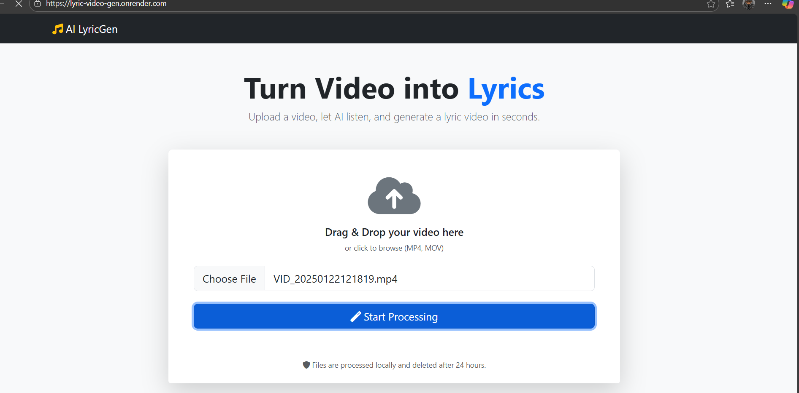

# 🎵 AI Lyric Video Generator (Cloud Ready)

A lightweight web application that automatically generates lyric videos from video files. It uses **AI (Faster-Whisper)** to transcribe audio with word-level timestamps and **MoviePy** to render animated text overlays.

**Live Demo:** [https://lyric-video-gen.onrender.com](https://lyric-video-gen.onrender.com) _(Note: Free tier servers spin down after inactivity, so the first load may take 50 seconds)_

 *(Optional: Add a screenshot of your editor interface here)*

## ✨ Features

* **Auto-Transcription:** Uses `faster-whisper` (int8 quantization) to transcribe audio accurately while using <400MB RAM.
* **Lyric Editor:** Interactive UI to correct words and timestamps before rendering.
* **Custom Styling:** Choose from "Clean White", "IG Neon", "Emoji", and more.
* **Animation Effects:** Karaoke bounce, slide-up, and pop-in text animations.
* **Cloud Optimized:** Built specifically to run on free-tier hosting (Render/Heroku) without OOM (Out of Memory) crashes.
* **Cross-Platform:** Works on Windows, Mac, and Linux (Docker).

## 🛠️ Tech Stack

* **Backend:** Flask (Python 3.9)
* **AI Engine:** Faster-Whisper (CTranslate2)
* **Video Processing:** MoviePy 1.0.3 + ImageMagick
* **Frontend:** HTML5, Bootstrap 5, Vanilla JS
* **Deployment:** Docker + Gunicorn

---

## 🚀 How to Run Locally

### 1. Prerequisites
* Python 3.9+ installed.
* **ImageMagick Installed:**
    * **Windows:** [Download Installer](https://imagemagick.org/script/download.php#windows).  
        ⚠️ **CRITICAL:** During installation, check the box **"Install legacy utilities (e.g. convert)"**.
    * **Mac/Linux:** `brew install imagemagick` or `sudo apt install imagemagick`.

### 2. Clone & Install
```bash
git clone [https://github.com/ntokozo078/lyric-video-gen.git](https://github.com/ntokozo078/lyric-video-gen.git)
cd lyric-video-gen

# Create Virtual Environment
python -m venv .venv
# Activate: Windows -> .venv\Scripts\activate  |  Mac/Linux -> source .venv/bin/activate

# Install Dependencies
pip install -r requirements.txt